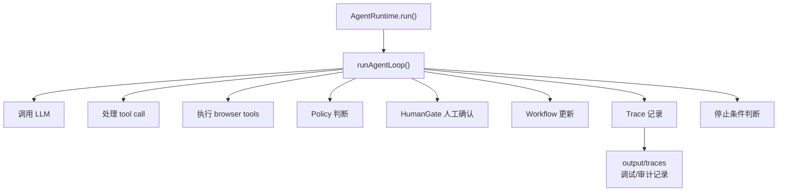
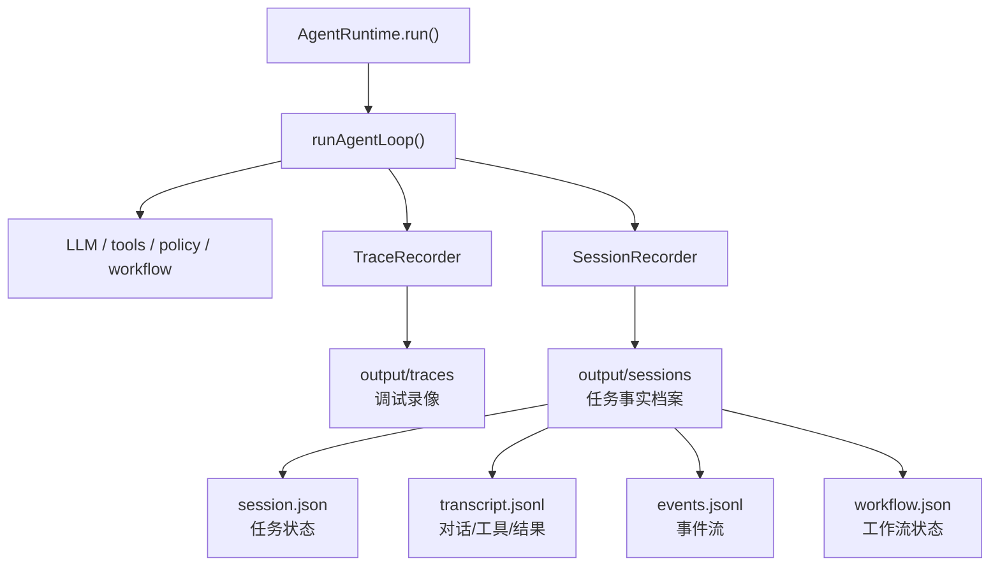
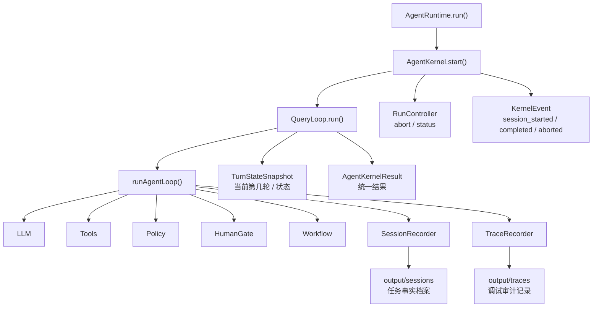

# Plan 2 完成说明：AgentKernel Skeleton 到底做了什么

> 这份文档是 `PLAN/phase2/plan2.md` 完成后的通俗解释。
> 它说明 Phase 2A/2B 和 Phase 1 trace 的区别，以及为什么要在现有 `runAgentLoop` 外面包一层 Kernel。

## 1. 先用一句话理解

Phase 2 目前不是让 Agent 变聪明，而是让 Agent 从“能跑的网页自动化循环”变成“有档案、有状态、有控制入口的任务运行系统”。

可以这样理解：

```text
Trace    = 行车记录仪
Session  = 任务档案
Kernel   = 控制台
```

## 2. Phase 1 的 Trace 是什么

Phase 1 的 trace 更像“事后排查用的行车记录仪”。

它记录：

```text
第 1 步打开页面
第 2 步截图
第 3 步点击按钮
第 4 步输入姓名
第 5 步遇到风险
```

它主要给人看，用来回答：

- 刚才 Agent 做了什么？
- 哪一步失败了？
- 截图在哪里？
- 风险等级是什么？
- metrics / safety report 怎么复盘？

但是 trace 有一个重要边界：

> Trace 是调试和审计材料，不应该成为 Agent 继续运行的状态数据库。

就像行车记录仪能告诉你刚才怎么开车，但你不会靠行车记录仪来控制方向盘。

## 3. Phase 2A 的 Session 是什么

Phase 2A 加的是 `SessionStore`，也就是“任务档案”。

它把一次 Agent run 的事实保存下来：

```text
output/sessions/<sessionId>/
  session.json
  transcript.jsonl
  events.jsonl
  workflow.json
```

这些文件分别回答：

- `session.json`：这个任务是谁、现在是什么状态、什么时候开始/结束。
- `transcript.jsonl`：用户目标、模型回复、工具调用、工具结果、错误、最终结果。
- `events.jsonl`：运行中的事件流，比如 `session_started`、`tool_completed`。
- `workflow.json`：当前工作流状态，比如观察中、填写中、需要人工接管。

所以 trace 和 session 的区别是：

```text
Trace   = 给人排查问题看的运行录像
Session = 给系统理解任务状态的事实档案
```

一个例子：

Agent 填表时碰到“提交申请”按钮。

Trace 可能记录：

```text
step 12: browser_click ref=e8
risk: L3
screenshot: shot-012.png
status: blocked
```

Session 会记录：

```text
tool_call: browser_click ref=e8
policy_decision: final_submit requires human gate
workflow_snapshot: ready_for_final_submit
final_result: blocked
reason: Final submit requires manual takeover
```

Trace 适合回看现场。
Session 适合系统知道“这个任务被 final submit gate 卡住了”。

## 4. Phase 2B 的 Kernel 是什么

Phase 2B 加的是 `AgentKernel`，也就是“控制台”。

以前是：

```text
AgentRuntime.run()
  -> runAgentLoop()
```

`runAgentLoop()` 里面什么都干：

```text
调模型
执行工具
判断安全策略
问人工确认
记录 session
更新 workflow
判断是否结束
```

这就像把油门、刹车、方向盘、仪表盘、行车记录仪全塞进发动机里。

Plan 2 完成后变成：

```text
AgentRuntime.run()
  -> AgentKernel.start()
    -> QueryLoop.run()
      -> runAgentLoop()
```

注意：Plan 2 没有重写发动机。

`runAgentLoop` 仍然是实际执行网页任务的主循环。Plan 2 只是先把它放到一个可管理的 Kernel 外壳下面。

## 5. 架构图：之前



之前最大的问题是：

```text
runAgentLoop 太像一个万能大管家：
它既负责怎么跑，也负责跑到哪了，还负责怎么停。
```

后面如果继续加暂停、恢复、任务控制台、工具生命周期、权限引擎，就会继续往 `runAgentLoop` 里面塞。

## 6. 架构图：Phase 2A 后



Phase 2A 解决的是：

> Agent 做过什么，终于有了稳定档案。

但运行入口还是旧的。

## 7. 架构图：Plan 2 完成后



直观理解：

```text
AgentKernel       = 控制台
QueryLoop         = 当前这次任务的运行调度
RunController     = 停止按钮 / 状态控制器
TurnStateSnapshot = 当前跑到第几轮
Session           = 任务档案
Trace             = 行车记录仪
runAgentLoop      = 现在仍然是实际干活的发动机
```

## 8. 所以这里是不是在解耦

是的，但要准确一点：

> Plan 2 解耦的是“运行控制”和“具体执行逻辑”。

以前：

```text
AgentRuntime 直接依赖 runAgentLoop
```

现在：

```text
AgentRuntime 依赖 AgentKernel
AgentKernel 调 QueryLoop
QueryLoop 当前暂时委托 runAgentLoop
```

这叫“先包住，再拆开”。

已经解耦出来的是：

- 外部运行入口。
- run 生命周期。
- abort 控制。
- kernel 级结果。
- turn 状态快照。
- runtime facade 和具体 loop 的直接绑定。

还没有完全拆出来的是：

- LLM 调用。
- tool 执行。
- policy 判断。
- HumanGate。
- workflow transition。
- session recording。

这些大部分现在还在 `runAgentLoop` 里面。Plan 2 的目标不是一次性拆完，而是先让后续拆分有一个稳定入口。

## 9. 一个能直接理解的例子

假设 Agent 正准备执行：

```text
browser_click "提交申请"
```

只有 Phase 1 trace 时，它主要能在事后告诉你：

```text
Agent 尝试点击了提交按钮
这个动作风险是 L3
被拦住了或者执行了
```

有了 Phase 2A session，系统能知道：

```text
这个任务最终状态是 blocked
阻塞原因是 final submit 需要人工接管
workflow 已经进入 ready_for_final_submit
```

有了 Phase 2B kernel，运行中还能做控制：

```text
用户是否点了停止？
controller 是否 abort？
这个 run 是否已经被取消？
```

如果你点了停止，结果会变成：

```text
status: aborted
summary: Run aborted
tool 没有执行
session 记录 final_result: aborted
```

这不是“事后录像”，而是“运行时控制”。

## 10. 为什么现在使用感可能变化不大

因为 Plan 2 不是做新 UI，也不是让模型更聪明。

它做的是底层结构：

```text
Phase 1  : Agent 会做事，并且有 trace 可复盘
Phase 2A : Agent 做过的事能形成任务档案
Phase 2B : Agent 的运行有统一控制入口
```

所以现在用 CLI 跑，感觉可能和之前差不多。

但内部已经从：

```text
一个大循环在跑
```

变成：

```text
一个 Kernel 管理一次 run
Session 记录任务事实
Trace 记录审计细节
runAgentLoop 继续负责实际执行
```

## 11. Plan 2 完成后的结论

Plan 2 完成的是：

> 先把 Agent 运行过程装进一个可管理的 Kernel 控制壳里。

它的价值不是马上增加一个肉眼可见的新功能，而是为后续能力铺地基：

- Plan 3 拆 `ToolExecutionService`。
- 后续接更完整的权限引擎。
- 后续支持暂停/恢复。
- 后续做 Task Cockpit UI。
- 后续做更稳定的 WorkflowEngine。

一句话总结：

```text
Trace 是看回放。
Session 是存档案。
Kernel 是管运行。
Plan 2 完成的，就是把“管运行”的第一层装上了。
```
