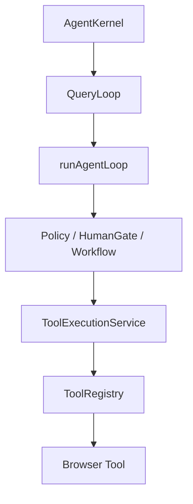

# Plan 3 完成说明：ToolExecutionService v1 到底做了什么

> 这份文档是 `PLAN/phase2/plan3.md` 完成后的通俗沉淀。
> 它说明 Plan 3 实现了什么功能、目的是什么、意义是什么、哪些点最值得讲，以及背后的第一性原理。

## 1. 先用一句话理解

Plan 3 做的是：

> 把“单个工具调用怎么执行”从 `runAgentLoop` 里拆出来，形成独立的 `ToolExecutionService v1`。

如果 Plan 2 是把 Agent 外面包上 `AgentKernel` 控制台，那么 Plan 3 就是开始拆里面最重的一块：工具执行生命周期。

## 2. 之前的问题

Plan 3 之前，`runAgentLoop` 既负责主循环，也负责工具执行细节：

```text
runAgentLoop
  -> 调模型
  -> 得到 tool call
  -> 判断 policy
  -> 走 HumanGate
  -> 执行 tool
  -> 处理 tool error
  -> 记录 trace/session
  -> 把 observation 塞回模型
  -> 进入下一轮
```

这让 `runAgentLoop` 越来越胖。

它既要决定“下一轮怎么推进”，又要处理“这个工具怎么执行、失败、超时、中止”。

## 3. Plan 3 后的结构

Plan 3 后，工具执行变成独立服务：

```text
runAgentLoop
  -> policy / HumanGate / workflow
  -> ToolExecutionService.execute()
       -> queued
       -> running
       -> succeeded / failed / cancelled / timed_out
       -> NormalizedToolResult
```

也就是：

```text
runAgentLoop          负责 Agent 主流程
ToolExecutionService 负责单个工具调用的执行过程
```

架构关系：



注意：Plan 3 没有让 `QueryLoop` 直接调度 tool calls，也没有重写 `runAgentLoop`。

它只是把“policy 已允许之后，单个工具调用如何执行”的逻辑抽出来。

## 4. 实现了哪些功能

## 4.1 统一工具执行入口

以前工具执行主要走：

```text
ToolExecutionBoundary.execute()
```

现在 `runAgentLoop` 通过：

```text
ToolExecutionService.execute()
```

来执行单个工具。

`ToolExecutionBoundary` 仍然保留，用来保证旧测试、旧 import、旧调用方式不断。

## 4.2 新增 ToolUseContext

每个工具执行时，现在会带上执行上下文：

```text
runId
sessionId
turnId
step
toolCallId
abortSignal
metadata
```

这让工具执行层知道：

```text
这是哪一次 run
哪一轮 turn
哪个 tool call
是否已经被 abort
有什么 risk / policy metadata
```

但 `ToolUseContext` 不包含这些东西：

```text
requestPermission()
gate.confirm()
SessionRecorder
WorkflowState mutator
prompt / messages
retry policy
```

原因是：Plan 3 只做工具生命周期，不提前把 PermissionEngine / WorkflowEngine 混进来。

## 4.3 新增 ToolExecutionState

工具执行不再只是“调用一个函数”，而是有状态：

```text
queued
running
succeeded
failed
cancelled
timed_out
blocked
```

这些状态让后续 UI 可以展示：

```text
当前工具已排队
当前工具正在执行
当前工具执行成功
当前工具失败
当前工具被取消
当前工具超时
```

这是 Task Cockpit、tool progress、metrics 继续演进的基础。

## 4.4 新增 NormalizedToolResult

工具结果现在会被归一化：

```text
schemaVersion
toolCallId
name
args
ok
status
observation
error
queuedAt
startedAt
completedAt
durationMs
```

以前不同失败长得不一样，有的靠 `FAILED (...)` 字符串，有的是 `Unknown tool:`，有的是 throw。

现在这些失败会变成结构化结果。

## 4.5 支持 abort-before-execution

如果工具执行前 signal 已经 abort：

```text
工具不会被执行
status = cancelled
error.kind = aborted
observation = FAILED (ABORTED): ...
```

这和 Plan 2 的 `RunController` 接上了。

`runAgentLoop` 仍保留执行前 abort check，用于保持 session 终态仍然是：

```text
final_result: aborted
AgentKernelResult.status = aborted
```

## 4.6 支持 timeout 归一化

`ToolExecutionService` 支持执行层 timeout：

```text
ToolUseContext.timeoutMs
  -> ToolExecutionServiceOptions.defaultTimeoutMs
  -> undefined
```

超时时结果统一为：

```text
status      = timed_out
ok          = false
error.kind  = timeout
error.code  = TOOL_TIMEOUT
observation = FAILED (TOOL_TIMEOUT): Tool <name> timed out after <timeoutMs>ms.
```

注意：这不是强行中断已经进入 Playwright 的动作。

v1 只是让执行层先返回 timeout。后续如果底层工具产生 late side effect，只能通过 snapshot / trace 再观察，Plan 3 不做补偿。

## 4.7 错误归一化

这些情况都会被整理成统一结果：

```text
LocalToolRunResult success
FAILED (...) observation
Unknown tool
tool throw exception
invalid result
abort
timeout
```

对应语义：

```text
ok = true / false
status = succeeded / failed / cancelled / timed_out
error.kind = tool_failed_observation / unknown_tool / registry_exception / invalid_result / aborted / timeout
```

这比到处用字符串判断更稳。

## 5. 这个阶段的目的

Plan 3 的目的不是让 Agent 更聪明，而是让工具执行更可靠、更可观察、更容易测试。

它解决的是这个问题：

> Agent 每一次调用工具，本质上都是一次对外部世界的动作。这个动作应该有生命周期、状态、错误语义和审计结果，而不是随手调用一个函数。

所以 Plan 3 把“工具执行”变成一个明确的 runtime boundary。

## 6. 这个阶段的意义

Plan 2 解耦的是：

```text
运行控制入口  vs  具体主循环
```

Plan 3 解耦的是：

```text
Agent 主循环推进  vs  单个工具执行生命周期
```

这一步的意义是让后续能力有地方接：

```text
工具超时
工具重试
工具取消
工具状态展示
工具错误统计
权限系统接入
Task Cockpit 展示当前 tool
ToolExecutionService 后续被 QueryLoop 直接调度
```

如果没有 Plan 3，未来这些能力都会继续塞进 `runAgentLoop`。

## 7. 比较重要的几个可以讲的点

## 7.1 Plan 3 没有重写主循环

这是稳定性的关键。

`runAgentLoop` 还在，prompt、tool schema、policy、HumanGate、workflow 都没有被大改。

这叫：

```text
先抽一块边界清楚的逻辑，而不是推倒重来。
```

## 7.2 ToolExecutionService 只管执行，不管决策

它不决定：

```text
这个动作能不能做
要不要问用户
workflow 进入哪一步
模型下一轮说什么
```

这些还在 `runAgentLoop`。

它只管：

```text
这个工具调用如何被执行
执行状态是什么
失败如何归一化
有没有 abort / timeout
```

这条边界非常重要。否则 `ToolExecutionService` 会偷偷变成 PermissionEngine 或 WorkflowEngine。

## 7.3 NormalizedToolResult 是核心收益

以前失败主要靠字符串：

```text
FAILED (...)
Unknown tool
Tool xxx threw
```

现在这些会被整理成结构化结果：

```text
ok
status
error.kind
error.code
observation
durationMs
```

这对测试、UI、metrics、后续恢复都更友好。

## 7.4 兼容比“拆得彻底”更重要

Plan 3 明确不改变：

```text
AgentRuntimeResult schema
AgentLoopResult
session transcript entry types
prompt
tool schema
policy decision
HumanGate final submit 语义
```

所以这是一次底层结构升级，不是用户可见行为大改。

## 7.5 它是后续 PermissionEngine / retry / Task Cockpit 的前置条件

如果没有 ToolExecutionService，未来 retry、timeout、permission、queue、并发执行都会继续塞进 `runAgentLoop`。

现在先把“工具执行”变成独立单元，后面才能继续拆。

## 8. 第一性原理

Plan 3 的第一性原理是：

> 工具调用不是普通函数调用，而是 Agent 对外部世界的一次受控动作。

普通函数调用只关心：

```text
输入 -> 输出
```

但 Agent 工具调用必须关心：

```text
什么时候开始
是否真的执行
执行了多久
是否成功
失败原因是什么
是否被取消
是否超时
结果是否能给模型继续用
是否能被审计和回放
```

所以它天然需要一个生命周期：

```text
queued -> running -> succeeded / failed / cancelled / timed_out
```

这就是为什么要有 `ToolExecutionService`。

更底层地说，Agent runtime 里至少有两类职责：

```text
决策推进：下一步做什么
动作执行：这一步怎么可靠完成
```

`runAgentLoop` 应该更多负责“决策推进”。

`ToolExecutionService` 应该负责“动作执行”。

这就是 Plan 3 的本质：

> 把“Agent 怎么想下一步”和“工具调用怎么被执行”分开。

## 9. 当前实现的边界

Plan 3 v1 已经做到：

- 工具执行入口独立。
- 工具状态可表达。
- 工具结果可归一化。
- abort-before-execution 可处理。
- timeout 可归一化。
- fatal error 可继续走原有 failed session 路径。
- `ToolExecutionBoundary` 保持兼容。
- `runAgentLoop` 直接调用保持兼容。

Plan 3 v1 暂时不做：

- 不做 retry。
- 不做并发 tool execution。
- 不做 streaming tool output。
- 不做 PermissionEngine。
- 不做 WorkflowEngine。
- 不保证强制中断正在执行的 Playwright action。
- 不改变模型看到的正常工具 observation。

## 10. 一句话收束

Plan 3 完成的，就是把工具调用从“主循环里的一个函数调用”升级成“有生命周期、有状态、有错误语义的执行单元”。

它不让 Agent 立刻更聪明，但让 Agent runtime 更像一个可以继续演进的系统。
