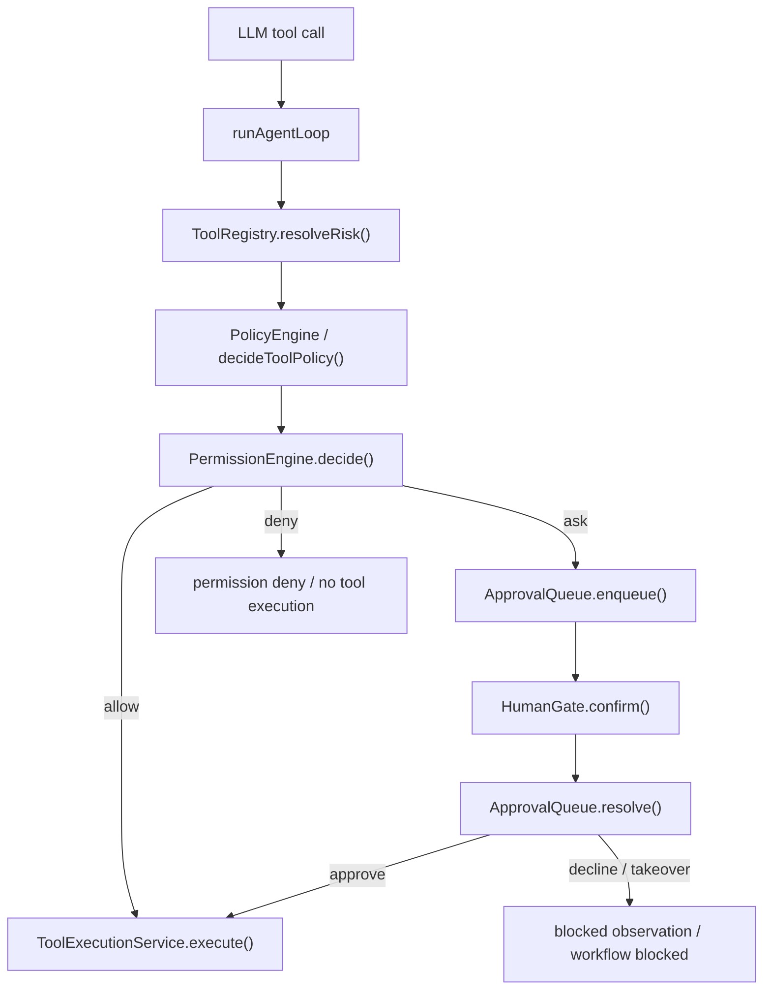
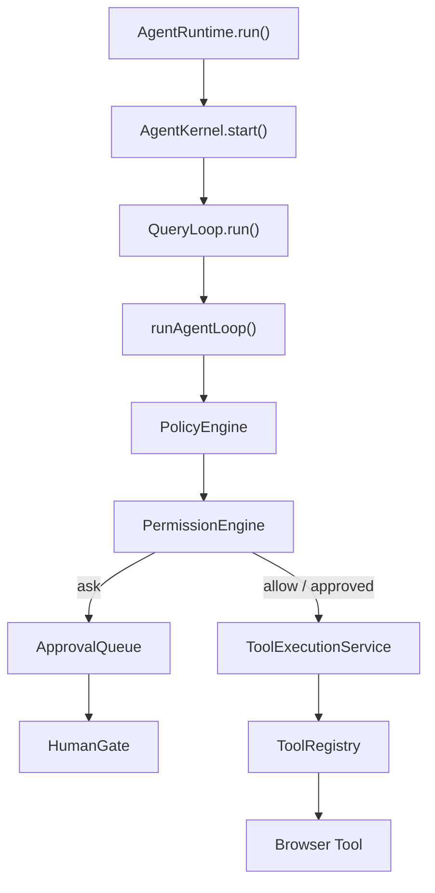

# Plan 4 完成说明：PermissionEngine v1 到底做了什么

> 这份文档是 `PLAN/phase2/plan4.md` 完成后的通俗沉淀。
> 它说明 Plan 4 实现了什么、为什么要做、意义是什么、具体怎么接入，以及背后的第一性原理。

## 1. 先用一句话理解

Plan 4 做的是：

> 把“风险判断”和“是否允许执行”拆成两层：`PolicyEngine` 继续判断风险，`PermissionEngine` 统一给出 `allow / ask / deny`。

Plan 3 已经把“工具怎么执行”从 `runAgentLoop` 里拆成了 `ToolExecutionService`。

Plan 4 继续拆的是工具执行之前的安全许可链路：

```text
runAgentLoop
  -> decideToolPolicy()
  -> permissionEngine.decide()
  -> allow: 执行工具
  -> ask: 进入 ApprovalQueue，再调用 HumanGate.confirm()
  -> deny: 不执行工具，写 blocked observation / session event
  -> ToolExecutionService.execute()
```

也就是说：

```text
PolicyEngine         负责风险判断和策略建议
PermissionEngine     负责执行许可结论
ApprovalQueue        负责本次运行内的待确认状态
HumanGate            负责真正询问用户
ToolExecutionService 负责已获许可后的工具执行
```

## 2. Plan 4 之前的问题

Plan 4 之前，`runAgentLoop` 里已经有一条可用的安全链路：

```text
registry.resolveRisk()
  -> decideToolPolicy()
  -> if block / auto_confirm / gate
  -> HumanGate.confirm()
  -> ToolExecutionService.execute()
```

这条链路能挡住高风险点击、final submit、上传、登录、验证码等敏感动作。

但它的问题是职责还不够清楚：

- `PolicyEngine` 的输出里既有风险判断，又带着 gate 建议。
- `runAgentLoop` 直接解释 `allow / gate / block / auto_confirm`，主循环继续膨胀。
- “需要用户确认的事项”没有统一队列，未来 UI 很难展示“当前等我确认什么”。
- session 里有 `policy_decision` 和 `human_gate_*`，但没有通用的 `permission_decision`。
- final submit、高风险 click、上传、login/captcha 不是同一个 permission 入口。

换句话说，Plan 4 之前系统知道“某个动作风险高”，也能“问用户”，但缺少中间这层稳定协议：

```text
这个动作此刻到底是允许、要问、还是拒绝？
```

这就是 `PermissionEngine` 要解决的问题。

## 3. Plan 4 后的结构

Plan 4 后，主链路变成：



每个工具调用现在都会经过统一 permission 入口：

```text
tool_call
  -> policy_decision
  -> permission_decision
  -> allow / ask / deny
```

只有 `ask` 会进入 ApprovalQueue 和 HumanGate。

低风险工具不会产生无意义的 approval request，但仍有 permission audit。

## 4. 实现了哪些功能

## 4.1 `PermissionEngine.decide()`

新增或完善了 `PermissionEngine`：

```text
PermissionRequest -> PermissionDecision
```

`PermissionDecision.action` 只有三个值：

```text
allow
ask
deny
```

这比 policy 的 action 更适合作为执行许可：

```text
PolicyAction     = allow | gate | block | auto_confirm
PermissionAction = allow | ask  | deny
```

policy 是建议和风险判断，permission 是执行许可结论。

## 4.2 每个 tool call 都有 `PermissionRequest`

`runAgentLoop` 在 policy decision 后构造 `PermissionRequest`：

```text
requestId
runId
sessionId
turnId
step
subject.toolName
subject.args
risk
riskLevel
currentUrl
workflowPhase
gateKind
policy metadata
freshness metadata
```

注意：request 只是数据结构。

它不包含：

```text
HumanGate
SessionRecorder
ToolExecutionService
Workflow mutator
prompt/messages
```

这保证 `PermissionEngine` 是一个纯判断服务，不会偷偷执行副作用。

## 4.3 policy block 映射为 permission deny

Plan 4 后：

```text
policy.action = block
  -> permission.action = deny
```

运行效果：

- 不调用 HumanGate。
- 不进入 ApprovalQueue。
- 不执行工具。
- 给模型写 blocked tool message。
- 写 `permission_decision`。
- 更新 workflow blocked。
- session 终态可以进入 blocked。

这让 `policy block -> permission deny` 成为稳定协议。

这次实现里也顺手校正了 stale high-risk policy：

```text
Context stale before high-risk action
  -> policy.action = block
  -> permission.action = deny
```

因为 stale context 不是“问用户就能安全执行”的问题，而是“上下文不新鲜，不能执行”的问题。

## 4.4 policy gate 映射为 permission ask

Plan 4 后：

```text
policy.action = gate
  -> permission.action = ask
```

`ask` 的动作会进入：

```text
ApprovalQueue.enqueue()
  -> session approval_request
  -> event approval_requested
  -> HumanGate.confirm()
  -> ApprovalQueue.resolve()
  -> session approval_decision
  -> event approval_resolved
```

旧事件仍保留：

```text
human_gate_requested
human_gate_resolved
```

也就是说旧 UI / 旧测试仍能读旧事件，新 UI 可以开始读新的 approval 事件。

## 4.5 raw auto_confirm 映射为 permission allow

raw safety mode 里的兼容行为保留：

```text
policy.action = auto_confirm
  -> permission.action = allow
  -> runAgentLoop 设置 confirmed=true
  -> ToolExecutionService.execute()
```

这保证 raw 模式不会因为引入 PermissionEngine 而被破坏。

## 4.6 final submit 语义保持不变

Plan 4 最重要的安全约束之一：

> final submit 即使 HumanGate 返回 approve，也不由 Agent 自动点击最终提交按钮。

当前行为是：

```text
final submit
  -> policy gate
  -> permission ask
  -> ApprovalQueue
  -> HumanGate.confirm()
  -> approval resolved
  -> workflow blocked / manual takeover
  -> 不执行 submit tool
```

原因很简单：

final submit 是真实世界不可逆动作，当前系统还没有完整 Evidence / WorkflowEngine / 用户最终确认 UI，因此不能因为新增 PermissionEngine 就扩大权限。

Plan 4 做的是统一审计入口，不是放宽提交能力。

## 4.7 high-risk click approve 后执行工具

高风险点击现在走：

```text
high-risk click
  -> permission ask
  -> HumanGate approve
  -> confirmed=true
  -> ToolExecutionService.execute()
```

如果用户 `decline` 或 `takeover`：

```text
不执行工具
写 blocked observation
workflow blocked
session final_result blocked
```

## 4.8 upload approve 后执行工具

`browser_upload_file` 属于敏感输入和 L4 风险。

Plan 4 后：

```text
browser_upload_file
  -> permission ask
  -> HumanGate approve
  -> confirmed=true
  -> ToolExecutionService.execute()
```

没有改变 upload tool schema。

`confirmed=true` 仍由 `runAgentLoop` 在 permission allow / approval approve 后注入。

## 4.9 login / captcha workflow handoff 也进入 permission audit

当 workflow 判断页面进入：

```text
login_required
captcha_required
```

Plan 4 会构造 workflow handoff 类型的 `PermissionRequest`：

```text
subject.kind = workflow_handoff
gateKind = login / captcha
permission.action = ask
```

然后也会进入 ApprovalQueue / HumanGate / session event。

但 v1 不做完整恢复流程。

它只保证：

```text
这个 handoff 是可审计、可解释、可被未来 UI 展示的。
```

## 4.10 session transcript / events additive 增强

新增 transcript entry：

```text
permission_decision
approval_request
approval_decision
```

新增 event type：

```text
permission_evaluated
approval_requested
approval_resolved
```

这些都是 additive。

没有删除旧记录：

```text
policy_decision
human_gate_requested
human_gate_resolved
tool_call
tool_result
workflow_snapshot
final_result
```

所以旧 session reader 仍保持兼容。

## 5. 具体改了哪些关键文件

## 5.1 `runtime/local/agent-loop.ts`

这是 Plan 4 的主要集成点。

新增可选注入：

```ts
permissionEngine?: AgentLoopPermissionEngine
approvalQueue?: AgentLoopApprovalQueue
```

默认创建：

```ts
new PermissionEngine()
new ApprovalQueue()
```

旧调用方式仍兼容：

```ts
runAgentLoop(input)
```

主循环没有重写，只是在 policy 后插入 permission 分支：

```text
policy_decision
  -> createToolPermissionRequest()
  -> permissionEngine.decide()
  -> record permission_decision
  -> deny / ask / allow
```

## 5.2 `permission/permission-engine.ts`

新增 `decide()` 作为目标链路 API：

```ts
decide(request: PermissionRequest): PermissionDecision
```

它内部复用已有 `evaluate()`，保持旧测试和旧调用兼容。

## 5.3 `policy/policy-engine.ts`

把 stale high-risk 从 gate 修正为 block：

```text
freshness stale + high-risk
  -> action = block
```

这样它才能稳定映射到：

```text
permission.action = deny
```

## 5.4 `session/session-types.ts`

additive 增加 transcript 类型：

```text
PermissionDecisionEntry
ApprovalRequestEntry
ApprovalDecisionEntry
```

## 5.5 `kernel/kernel-events.ts`

additive 增加 event type：

```text
permission_evaluated
approval_requested
approval_resolved
```

## 5.6 `scripts/agent-loop-test.mjs`

新增 direct loop permission scenarios，覆盖：

- high-risk approve 后执行工具。
- final submit 进入 ask 但不执行工具。
- policy block 映射 permission deny。
- raw auto_confirm 映射 permission allow。
- upload approve 后设置 confirmed 并执行。
- HumanGate decline 后 blocked。
- HumanGate takeover 后 blocked。
- session 中出现 permission / approval 新记录。
- 旧 human gate event 仍存在。

## 6. 这个阶段的目的

Plan 4 的目的不是让 Agent 做更多事，而是让“能不能执行”这件事变成稳定协议。

核心目标是：

> 在模型提出工具调用后，系统能用统一方式回答：允许、询问、拒绝。

这件事必须独立于：

- 工具具体怎么执行。
- 用户具体怎么被询问。
- workflow 现在在哪一步。
- session 怎么落盘。
- prompt 怎么写。

所以 Plan 4 的真正目标是把安全链路分层。

## 7. 这个阶段的意义

## 7.1 让安全边界更清楚

Plan 4 后，不能再把所有东西都叫 gate。

系统有了明确分工：

```text
Policy    = 风险是什么，策略建议是什么。
Permission = 此刻能不能执行。
Approval  = 哪个事项正在等用户确认。
HumanGate = 怎么问用户。
ToolExec  = 获准之后怎么执行。
```

这会让后续扩展不再挤进主循环。

## 7.2 为 Task Cockpit 做准备

未来 UI 需要展示：

```text
当前等待我确认什么？
这个 approval 属于哪个 tool call？
风险等级是什么？
为什么需要确认？
用户最后选择了 approve / decline / takeover？
```

如果只有瞬时的 HumanGate 调用，UI 很难恢复这个状态。

Plan 4 的 ApprovalQueue v1 虽然只是内存队列，但它已经建立了标准模型：

```text
pending approval
resolved approval
approval resolution
```

这就是后续 Task Cockpit 的状态骨架。

## 7.3 为持久化 permission/resume 做准备

v1 不做持久 approval queue。

但 session transcript 已经能记录：

```text
permission_decision
approval_request
approval_decision
```

未来可以从 transcript 重建：

```text
有 approval_request
没有 approval_decision
  -> pending approval
```

这为跨进程恢复和 Web UI 操作打基础。

## 7.4 保持 ToolExecutionService 纯净

Plan 3 刚刚把工具执行拆出来。

Plan 4 没有把权限判断塞进 ToolExecutionService。

这很重要。

否则 ToolExecutionService 会变成：

```text
执行工具 + 判断权限 + 调用户确认 + 写 workflow
```

那 Plan 3 的边界就被破坏了。

现在边界仍然是：

```text
ToolExecutionService 只执行已经获准的工具。
```

## 7.5 保持 HumanGate 纯净

HumanGate 仍然只负责：

```text
confirm(kind, message, context) -> approve / decline / takeover
```

它不需要知道：

- PermissionRequest。
- ApprovalQueue。
- ToolExecutionService。
- WorkflowState。

这让 CLI gate、Auto gate、Scripted gate、未来 Web gate 都可以共用同一个接口。

## 8. 第一性原理

## 8.1 Policy 不是 Permission

Policy 回答的是：

```text
这个动作风险如何？
命中了哪条规则？
建议 allow / gate / block / auto_confirm？
为什么？
```

Permission 回答的是：

```text
这个动作此刻能不能执行？
allow / ask / deny？
```

这两个问题必须拆开。

原因是：风险判断和执行许可不是同一种东西。

比如：

```text
高风险点击
  -> policy: gate
  -> permission: ask
```

```text
上下文 stale 的高风险点击
  -> policy: block
  -> permission: deny
```

```text
raw 模式兼容点击
  -> policy: auto_confirm
  -> permission: allow
```

如果没有 PermissionEngine，`runAgentLoop` 就只能一直硬编码这些解释。

## 8.2 询问用户不是权限判断

HumanGate 做的是交互，不是策略。

它只回答：

```text
用户这次选择了 approve / decline / takeover
```

它不应该负责判断：

```text
这个 action 为什么需要问？
能不能记住？
是不是 final submit？
是否应该进入 ApprovalQueue？
```

这些都应该在 HumanGate 之前被 runtime 准备好。

## 8.3 工具执行不能决定自己是否可执行

工具执行层面对的是外部世界。

一旦工具被执行，副作用可能已经发生。

所以权限判断必须在执行之前完成：

```text
permission allow / approval approve
  -> ToolExecutionService.execute()
```

不能变成：

```text
ToolExecutionService.execute()
  -> 里面再判断要不要执行
```

这就是为什么 Plan 4 不给 `ToolUseContext` 加 `requestPermission()`。

## 8.4 final submit 是产品语义，不是普通高风险点击

final submit 的关键不是技术上能不能点，而是产品上不应该由 Agent 自动完成。

所以它不是：

```text
用户 approve -> Agent submit
```

而是：

```text
进入 final submit ask
记录 approval
交给 human takeover
Agent blocked
```

这个语义必须留在 `runAgentLoop` / workflow 层，因为它和任务完成、安全契约、用户接管有关，不是普通工具执行问题。

## 8.5 Runtime state 不能依赖 trace

Plan 4 继续坚持：

```text
trace 是审计，不是运行时数据库。
```

Permission / approval 的事实源是：

```text
session transcript/events
in-memory ApprovalQueue
```

不是：

```text
output/traces
page-state-latest.json
form-state-latest.json
```

验收也做了边界搜索，确认 runtime 相关目录没有读取这些 trace artifact。

## 9. 和 Plan 2 / Plan 3 的关系

Phase 2 到 Plan 4 为止，拆分路径是连续的：

```text
Plan 2: 把运行入口包进 AgentKernel。
Plan 3: 把工具执行拆成 ToolExecutionService。
Plan 4: 把执行许可拆成 PermissionEngine + ApprovalQueue。
```

现在的结构是：



`runAgentLoop` 还没有被完全拆完。

但现在它里面几块最关键的边界已经出现：

```text
Kernel boundary
Tool execution boundary
Permission boundary
Session/event audit boundary
Workflow transition boundary
```

这为后续 Plan 5 继续拆 Context Compaction、persistent approval resume、Task Cockpit、WorkflowEngine / Evidence 打基础。

## 10. 验收结果

本次完成后已验证：

```bash
npm run build
npm run test:permission-engine
npm run test:approval-queue
npm run test:tool-execution-service
npm run test:kernel
npm run test:session
npm run test:agent-runtime
npm run test:agent-loop
npm run test:mvp
git diff --check
```

边界搜索：

```bash
rg -n "output/traces|page-state-latest|form-state-latest" \
  packages/web-buddy/src/agent \
  packages/web-buddy/src/context \
  packages/web-buddy/src/runtime/local \
  packages/web-buddy/src/tools \
  packages/web-buddy/src/workflow \
  packages/web-buddy/src/session \
  packages/web-buddy/src/permission \
  --glob '*.ts'
```

结果：无命中。

覆盖的关键验收点：

- final submit 进入 permission ask。
- final submit 不执行最终 submit tool。
- high-risk action 进入 permission ask。
- upload 进入 permission ask。
- policy block 映射 permission deny。
- raw auto_confirm 映射 permission allow。
- HumanGate approve 后执行工具。
- HumanGate decline / takeover 后不执行工具并 blocked。
- abort-before-tool 仍不执行工具。
- ToolExecutionService 测试仍通过。
- AgentRuntime schema 不变。
- runAgentLoop 直接调用兼容。

## 11. 最后再压缩成一句话

Plan 4 的本质是：

> 把“模型想做一个动作”到“工具真的执行”之间，补上一层清晰、可审计、可扩展的执行许可协议。

这层协议让系统不再只靠 prompt 和散落在主循环里的 if/else 保证安全。

它把安全决策变成了结构化 runtime state：

```text
policy_decision
permission_decision
approval_request
approval_decision
tool_execution
```

这就是从 Web 自动化脚本走向真正 Agent Kernel 的关键一步。
