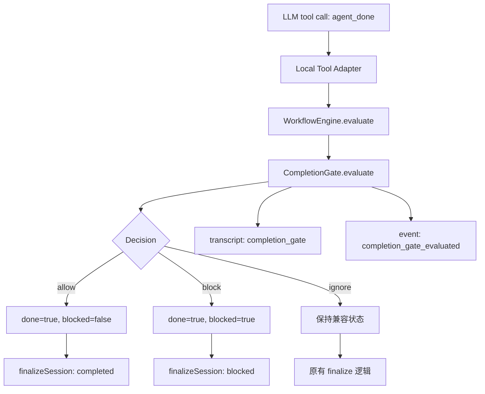

# Plan 7 完成说明：CompletionGate v1 + WorkflowGuard v1

> 本文档记录 `PLAN/phase2/plan7.md` 已完成的事情、实现意义、第一性原理，以及本次审查补齐的测试契约。

## 1. 一句话总结

Plan 7 把 `agent_done` 从“模型说我完成了”改成“模型申请完成，Runtime 根据 Workflow evidence 裁决能不能真的完成”。

Plan 6 让缺少证据这件事变得可见：

```text
agent_done
  -> WorkflowEngine.evaluate()
  -> missingCriteria 可审计
```

Plan 7 让缺少证据这件事真正影响最终状态：

```text
agent_done
  -> WorkflowEngine.evaluate()
  -> CompletionGate.evaluate()
  -> allow: completed
  -> block: blocked
```

## 2. 为什么需要这一步

在 Agent 系统里，LLM 的输出不能直接等于系统事实。

LLM 可以说：

```text
我已经完成任务。
```

但底层 Runtime 必须追问：

```text
有什么证据证明完成了？
有没有触发 final submit？
有没有用户确认？
有没有 policy / permission / approval 的关键记录？
Workflow 当前是不是 done？
```

所以 Plan 7 的目的不是增加一个普通日志，而是补上“完成裁决层”。

没有 Plan 7 时：

```text
agent_done blocked=false
  -> done=true
  -> blocked=false
  -> completed
```

有 Plan 7 后：

```text
agent_done blocked=false
  -> done=true
  -> WorkflowEngine 发现缺 user_confirm
  -> CompletionGate block
  -> done=true, blocked=true
  -> final status = blocked
```

这意味着 Agent 不能靠一句 `agent_done` 乐观结束。它必须让证据链满足 workflow 定义。

## 3. 第一性原理

Plan 7 的第一性原理可以压缩成三句话：

```text
LLM 负责提出完成。
Workflow evidence 负责证明完成。
Runtime / Kernel 负责裁决完成。
```

更底层一点：

```text
状态不能只来自语言声明。
状态必须来自可审计证据。
最终状态必须由确定性系统裁决。
```

这和人类工作流很像：

```text
员工说“我做完了”只是提交。
检查清单显示全部满足，主管才会验收。
如果缺签字或缺附件，这个任务仍然不能关单。
```

在这里：

- 员工：LLM。
- 检查清单：WorkflowDefinition / WorkflowEngine。
- 签字和附件：Evidence。
- 主管验收：CompletionGate。
- 关单结果：Kernel final status。

## 4. 本阶段实际完成了什么

### 4.1 新增 CompletionGate

新增文件：

```text
packages/web-buddy/src/workflow/completion-gate.ts
```

它是一个纯判断服务，只负责根据输入返回 decision：

```text
CompletionGateInput
  -> CompletionGate.evaluate()
  -> CompletionGateDecision
```

它不会：

- 执行工具。
- 调用 HumanGate。
- 调用 LLM。
- 修改 EvidenceStore。
- 写 session。
- 读取 trace artifacts。

它只裁决：

```text
allow | block | ignore
```

### 4.2 新增完成门审计记录

session transcript 新增：

```text
completion_gate
```

session events 新增：

```text
completion_gate_evaluated
```

记录内容包括：

- action。
- recommendedStatus。
- reason。
- workflow phase。
- missingCriteria。
- blockers。
- evidenceIds。

这让以后恢复、压缩、调试、UI 展示都能回答：

```text
为什么模型说完成了，但系统还是 blocked？
```

### 4.3 接入 runAgentLoop

核心接入点是 `agent_done` 工具执行后：

```text
agent_done result.done=true
  -> evaluateWorkflow(...)
  -> completionGate.evaluate(...)
  -> write completion_gate transcript/event
  -> if block:
       done = true
       blocked = true
       summary = decision.reason
  -> finalizeSession(completed | blocked)
```

这一步保持了 Plan 7 的最小边界：

- 不重写 `runAgentLoop`。
- 不改变 tool schema。
- 不改变 `AgentLoopResult` / `AgentRuntimeResult` schema。
- 不改变 final submit 安全语义。
- 不读取 trace artifacts。
- 不处理 no-tool-call 自然结束分支。

### 4.4 补齐上层测试契约

本次审查发现 Plan 7 主链路已实现，但两个上层旧测试还停留在 Plan 6 以前的语义：

```text
agent_done blocked=false -> completed
```

这已经不符合 Plan 7。Plan 7 的语义是：

```text
agent_done blocked=false + 缺 required evidence -> blocked
```

因此本次按最小边界只修改测试契约，不改生产实现：

```text
packages/web-buddy/scripts/agent-runtime-test.mjs
packages/web-buddy/scripts/agent-kernel-test.mjs
```

现在 runtime/kernel 层也会验证：

- `agent_done` 缺完成证据时最终是 `blocked`。
- `stopReason` 是 `blocked`。
- runtime event 能看到 completion gate block。
- kernel/session event 能看到 `session_blocked`。
- transcript 包含 `completion_gate`。

## 5. 和 Plan 6 的区别

Plan 6 做的是“看见问题”：

```text
WorkflowEngine 产出 matchedCriteria / missingCriteria / blockers。
session 记录 workflow_evidence / workflow_evaluation。
context compaction 保留 workflow 摘要。
```

但 Plan 6 仍然偏审计：

```text
证据不足可以被记录下来，
但不一定阻止 runtime completed。
```

Plan 7 做的是“用问题改变结果”：

```text
missingCriteria 不只是日志。
missingCriteria 会进入 CompletionGate。
CompletionGate 可以把 completed 改成 blocked。
```

最直观的例子：

```text
Plan 6:
  LLM: 我填完表了。
  WorkflowEngine: 缺 user_confirm。
  Runtime: 仍可能 completed。

Plan 7:
  LLM: 我填完表了。
  WorkflowEngine: 缺 user_confirm。
  CompletionGate: 不允许 completed。
  Runtime: blocked，等待人工确认或下一步恢复。
```

## 6. 架构变化



它本质上是进一步解耦：

```text
LLM 决策意图
  和
Runtime 最终状态裁决
```

之前这两者靠 `agent_done` 粘在一起。Plan 7 把它们拆开，中间加了一个可测试、可审计、可替换的 CompletionGate。

## 7. 重要可讲点

### 7.1 agent_done 现在只是完成申请

`agent_done` 不再天然等于完成。

它更像：

```text
我认为任务可以结束了，请系统验收。
```

系统验收通过才是 `completed`。

### 7.2 user_confirm 成为硬证据

当前 job application workflow 的 done criteria 需要：

```text
tool_result + user_confirm
```

所以只要没有 `user_confirm`，普通 `agent_done blocked=false` 会被 CompletionGate 拦下。

这不是 bug，而是 Plan 7 的安全收紧：

```text
涉及最终完成的状态，不能只靠模型自证。
```

### 7.3 final submit 安全语义没有放宽

如果 workflow phase 是：

```text
ready_for_final_submit
```

或者存在：

```text
gateKind = final_submit
```

CompletionGate 会 block。即使前面的 approval / HumanGate 有确认，也不会自动把 final submit 变成 completed。

### 7.4 CompletionGate 是纯服务

CompletionGate 不碰浏览器、不碰用户、不碰 LLM。

这让它非常适合被单测覆盖，也适合以后替换成更复杂的 WorkflowGuard。

## 8. 审查结论

Plan 7 的核心生产实现方向是正确的：

- CompletionGate 已独立成纯判断模块。
- `runAgentLoop` 已在 `agent_done` 后接入 gate。
- session transcript/events 已能审计 gate decision。
- final submit 和 missing required evidence 会被 block。
- schema 兼容边界保持住了。

本次审查修补了上层测试契约：

- `agent-runtime-test` 从旧的 completed 断言改为 Plan 7 的 blocked 断言。
- `agent-kernel-test` 从旧的 `session_completed` 断言改为 `session_blocked` 和 `completion_gate` 审计断言。

## 9. 已知边界

当前仍有几个刻意保留的边界：

1. 没有新增真实的 `user_confirm` 采集入口。

   现在 CompletionGate 会要求 `user_confirm`，但系统还没有一个完整的用户确认 UI / command / resume flow 来生成这类 evidence。这意味着普通自动填表完成后会停在 `blocked`，等待下一阶段补“人工确认后恢复/完成”的链路。

2. no-tool-call 自然结束分支没有强行纳入 CompletionGate。

   Plan 7 v1 只在 `agent_done` 后强制 gate，保持兼容。

3. CompletionGate 不负责恢复运行。

   它只说明“为什么不能完成”，下一步恢复、继续、人工接管仍需要后续阶段完成。

## 10. 本次验证

本次审查后已通过：

```bash
npm --prefix packages/web-buddy run test:workflow
npm --prefix packages/web-buddy run test:agent-loop
npm --prefix packages/web-buddy run test:session
npm --prefix packages/web-buddy run test:agent-runtime
npm --prefix packages/web-buddy run test:kernel
```

这些验证覆盖了：

- CompletionGate 纯逻辑。
- WorkflowEngine missing criteria。
- `runAgentLoop` 集成。
- session transcript/events。
- AgentRuntime facade。
- AgentKernel final status。
