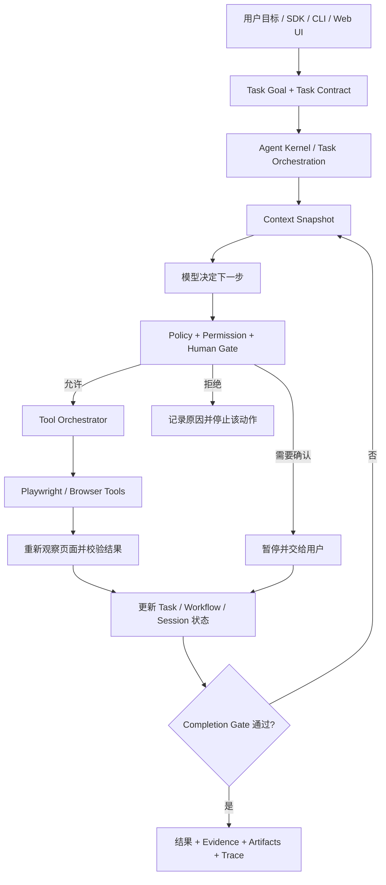

# Web Buddy

> 让 AI 不只会“看网页、回答问题”，还能够安全地完成研究、比较、填表和后台操作等多步骤网页任务。

Web Buddy 是一个运行在本地的通用 Web Agent Runtime。你可以给它一个目标，例如：

- “阅读这几个页面，整理结论并保留来源。”
- “比较这些候选方案，告诉我哪个满足全部条件。”
- “把资料填进表单，检查无误后停在提交之前。”
- “处理一批后台单据，只把异常项和最终确认留给我。”

它会自己观察页面、规划下一步、调用浏览器工具并检查结果。与此同时，Runtime 会持续管理任务进度、页面状态、上下文、权限和执行证据，避免模型失控、重复操作，或者在没有确认时完成高风险动作。

一句话理解：**Web Buddy 是夹在大模型与真实网页之间的“执行与治理层”。**

[快速开始](#快速开始) · [核心设计](#核心设计) · [安全边界](#安全边界) · [Public SDK](#public-sdk) · [仓库结构](#仓库结构)

## 它能做什么

Web Buddy 不绑定某个网站，也不只服务于招聘场景。不同任务共用同一套 Agent Loop、浏览器工具和安全机制，场景差异由任务目标、Skill、Policy 和 Workflow 表达。

| 场景 | Web Buddy 可以做什么 | 默认停在哪里 |
| --- | --- | --- |
| 网页研究 | 浏览页面、提取事实、跨页面汇总、保留来源证据 | 全程只读 |
| 比较与决策 | 收集候选项、核对硬性条件、记录淘汰原因、生成比较报告 | 不替用户购买或确认 |
| 通用表单 | 识别字段、规划答案、询问缺失信息、填写并回读检查 | 上传、保存、提交前按风险确认 |
| 多页面流程 | 在搜索、详情、编辑、复核等页面之间持续推进任务 | 登录、验证码、身份验证交给用户 |
| 预订与交易准备 | 比较场地或服务、填写预订草稿、核对价格和条款 | 创建订单、签约或支付之前 |
| 后台事务 | 浏览管理后台、整理记录、准备重复操作的处理草稿 | 产生外部写入前确认 |
| 招聘辅助 | 职位研究、岗位匹配、申请表草稿、投递前检查 | 最终投递始终受控 |
| 自定义网页任务 | 通过 SDK、CLI 或 Skill 接入新的站点与工作流 | 继续复用统一安全边界 |

## 为什么不是普通的浏览器脚本

传统脚本适合“页面不变、路径固定”的流程；简单的浏览器 Agent 虽然灵活，但经常只有一段 Prompt 和一组点击工具。Web Buddy 更关注真实任务长期运行时会遇到的问题：

- **目标不是“点几下”，而是“把事情做完”**：任务带有明确的完成条件、所需证据和禁止动作，模型说“完成了”不等于真的完成。
- **长任务不会越跑越乱**：Task Graph、Workflow 和 Session 分别记录依赖、阶段、会话与动作结果，任务可以暂停、恢复和复盘。
- **不会把全部历史反复塞给模型**：Context Manager 只选择当前真正需要的信息，并在接近 token 上限时分层压缩历史。
- **安全不只写在 Prompt 里**：工具执行前必须经过 Policy、Permission 和 Human Gate；项目 Skill 不能放宽 Runtime 的硬安全规则。
- **能力可以积累，而不是不断复制 Prompt**：站点知识、任务经验和完成标准可以封装成 Skill，按任务类型、域名、URL 或工作流阶段自动加载。
- **每一步都有证据**：页面状态、工具调用、风险判断、截图、指标和结果产物可以被审计，Trace 不只是终端里的一串日志。

## 快速开始

### 1. 先跑一个不需要模型 Key 的本地体验

环境要求：

- Node.js `>= 20`
- npm
- macOS、Linux 或 Windows WSL

```bash
git clone https://github.com/Xionglt/WebBuddy.git
cd WebBuddy/packages/web-buddy
npm install
npm run build
```

`npm install` 会安装 Playwright Chromium。接着运行两个完全离线的 Demo：

```bash
# 自动填写本地表单，并停在保存/提交边界
npm run demo:form:offline

# 阅读本地页面并生成带证据的研究结果
npm run demo:research

# 为最近一次运行生成安全报告
npm run report:safety
```

这三条命令不需要账号，不需要模型 Key，也不会访问真实业务网站。运行结果会写入仓库根目录的 `output/`。

如果你在本地配置了 `PLAYWRIGHT_KEEP_BROWSER_OPEN=true`，Demo 完成后会保留浏览器进程；按 `Ctrl+C` 即可退出。

### 2. 启动 Web 控制台

Web 控制台可以用来创建和查看 Run、处理 Approval、检查 Trace 与 Artifact。启动服务前先生成一个本地访问 token：

```bash
export WEB_BUDDY_API_TOKEN="$(openssl rand -hex 32)"
npm run web
```

打开：

```text
http://localhost:5178
```

在页面中输入同一个 token 即可进入控制台。模型 Key 只从服务端环境变量读取，不会由 Web 页面接收或持久化。

### 3. 接入模型，运行自定义网页任务

离线 Demo 之外，通用 `raw`、真实站点填表和 LLM 规划需要一个支持 tool/function calling 的模型。

先在仓库根目录准备配置：

```bash
cd ../..
cp configs/agent.env.example .env
```

以 OpenAI-compatible 接口为例：

```env
MODEL_PROVIDER=openai
MODEL_API_KEY=your_key
MODEL_BASE_URL=https://api.openai.com/v1
MODEL_NAME=gpt-4o-mini
```

Anthropic-compatible、GLM 和 DashScope/Qwen 的配置示例也在 [`configs/agent.env.example`](configs/agent.env.example) 中。不要提交填有真实 Key 的 `.env`。

验证模型是否支持项目需要的调用格式：

```bash
cd packages/web-buddy
npm run test:model
```

然后可以运行通用表单任务：

```bash
npm run fill -- https://your-site.example/form
```

如果网站需要登录，先让用户在可见浏览器中完成登录和验证码，再复用保存的登录态：

```bash
npm run login -- https://your-site.example/
npm run fill -- https://your-site.example/form
```

Web Buddy 不会自动输入密码、破解验证码或绕过网站的人机验证。

## Web Buddy 怎么工作

一次运行不是“把网页截图丢给模型，然后照着模型说的点”。完整链路如下：



这里有三个重要原则：

1. 模型负责理解页面和选择下一步，Runtime 负责执行、约束和验证。
2. 页面内容默认是不可信数据，不能因为网页里写着“忽略规则”就改变系统权限。
3. 完成、失败和阻塞都必须有当前状态或证据支持，不能只接受模型的口头判断。

## 核心设计

### 1. 任务编排：把一个目标变成可完成、可验证的任务

在 Web Buddy 中，一个任务不只是一段 Prompt，它至少包含四部分：

| 部分 | 作用 |
| --- | --- |
| `TaskGoal` | 用户真正想完成什么，以及属于哪类场景 |
| `TaskContract` | 什么才算完成、必须产生哪些证据、哪些动作不能发生 |
| `ContextItem / ContextProvider` | 任务可使用的资料、来源、有效期和敏感级别 |
| `TaskPolicy` | 对导航、填写、上传、发送、提交等敏感动作的规则 |

复杂任务可以进入 Task Graph：

- 用依赖关系表达哪些任务必须先完成。
- 只读研究、确定性计算等后台任务可以受控并发。
- 浏览器页面保持单一写入者，避免多个 Agent 同时点击和填写造成竞态。
- 调度器处理容量、lease、重试、取消、会话中止和结果通知。
- 后台结果回到主任务前会检查新鲜度，过期结果不能覆盖当前页面状态。
- `Completion Gate` 会核对完成条件、页面证据、必填项、异步任务和待确认动作，拒绝过早结束。

因此，“模型认为完成”只是一个申请，最终是否完成由 Runtime 判断。

### 2. 状态管理：知道现在在哪、做过什么、还能不能继续

Web Buddy 把状态拆开管理，避免用一大段聊天记录同时承担所有职责：

| 状态层 | 记录内容 | 解决的问题 |
| --- | --- | --- |
| Observation | 当前 `PageState`、`FormState`、页面类型、字段覆盖率 | 模型现在看到的页面到底是什么 |
| Task | 任务阶段、动作结果与阻塞原因 | 哪些动作已经成功，哪些仍待处理 |
| Workflow | 当前流程阶段、转换条件、证据和人工确认 | 搜索、填写、复核、提交等阶段如何推进 |
| Session | 目标、消息、工具调用、工具结果、事件和恢复点 | 进程中断后如何继续 |
| Control Plane | Run revision/attempt、Approval、幂等键和 owner scope | 服务化运行如何避免重复写入和越权访问 |
| Trace | 截图、指标、风险决策和诊断产物 | 事后如何审计与评估 |

`transcript.jsonl` 和 Session facts 是恢复运行的事实来源；Trace 是审计面，Runtime 不会从诊断文件里“猜”出状态。这样即使删除截图或报告，也不会破坏会话恢复语义。

### 3. 上下文管理：给模型刚好够用的信息

长任务最容易遇到两个问题：上下文越来越贵，以及旧信息污染当前判断。Web Buddy 的 Context Manager 会按当前任务组装上下文，例如：

- 用户目标与 Task Contract
- 最新页面和表单状态
- Workflow、Task Graph 与待处理动作
- 表单填写计划、已填写账本和用户补充答案
- 当前运行记忆与检索到的相关长期记忆
- 最近工具调用和失败原因
- 当前命中的 Skill 与安全提示

每条 `ContextItem` 还带有来源、可信度、指令权限、敏感等级、新鲜度、允许用途、保留策略和完整性信息。来自网页的内容可以参与回答，但默认不能取得系统指令权限。

当上下文接近预算上限时，系统会：

1. 先对重复、低价值工具结果做 micro compaction。
2. 再生成结构化运行摘要，保留目标、决定、阻塞、证据和未完成事项。
3. 在可用时补充语义摘要，同时保留最近一段原始对话。
4. 维持消息与 tool result 的边界，保证恢复后仍是合法对话。
5. 结合 prompt cache 状态，避免无意义地重写仍然有效的缓存前缀。

Memory 也不是无限追加的文本。项目为记忆提供 scope、revision、TTL、provenance、冲突、supersede 和 tombstone 生命周期，并在写入前应用敏感信息与权限策略。

### 4. 工具系统：工具不只是一个可调用函数

所有工具先进入统一 Catalog，再由 Local Runtime 或 MCP Adapter 暴露。一个工具会声明参数、风险等级、读写属性、资源占用和执行方式。

一次工具调用会经历：

```text
模型提出调用
  → 参数与工具契约检查
  → Policy 风险判断
  → Permission / Approval 判断
  → 串行、并行或独占执行计划
  → timeout / abort / stop policy
  → 按原始顺序提交结果
  → 页面后置条件与结果新鲜度检查
  → 写入状态、Trace 或 Artifact
```

这套工具层有几个关键特性：

- 只读、无共享资源的工具可以并行；浏览器写操作和 Run State 更新保持独占。
- 页面元素使用 snapshot ref，页面变化后会识别 stale ref 并重新观察。
- 点击或填写后会检查 URL、页面、字段回读等 postcondition，而不是只看 Playwright 有没有抛错。
- 大型工具结果可以落成 Artifact，模型上下文只保留引用和摘要。
- 工具超时、取消和终止原因使用统一结果模型。
- 默认 MCP surface 只暴露观察类工具，不能借 MCP 绕过本地 Agent Loop 的写入权限。

浏览器工具覆盖页面打开、结构化 snapshot、表单审计、截图、点击、输入、选择、按键、等待和文件上传；`ask_user`、`plan_form_fill`、`resume_query`、`agent_done` 等任务工具则负责人与任务层的协作。

### 5. Skill 设计：把场景经验变成可组合能力

Skill 是带 JSON manifest 的 `SKILL.md`。它可以描述：

- 什么时候加载：任务类型、域名、URL pattern、Workflow phase 或工具名。
- 给模型什么：Prompt section 和下一步建议。
- 给 Runtime 什么：Policy hint、完成条件和 Memory query。
- 从哪里加载：内置、项目或用户目录，以及优先级。

一个简化的 Skill 如下：

```md
---
{
  "schemaVersion": "web-buddy-skill/v1",
  "id": "example.task-compare",
  "name": "Compare Products",
  "scope": "project",
  "priority": 100,
  "triggers": {
    "taskTypes": ["explore"]
  },
  "provides": {
    "promptSections": ["NEXT_ACTION_RULES"],
    "completionCriteria": true
  },
  "promptSections": [
    {
      "id": "NEXT_ACTION_RULES",
      "summary": "先核对硬性条件，再比较价格；每个结论都保留页面证据。"
    }
  ],
  "completionCriteria": [
    {
      "id": "comparison-evidence-ready",
      "kind": "required_evidence",
      "description": "比较结果必须包含来源证据。",
      "evidenceKeys": ["comparison.report"],
      "severity": "block"
    }
  ]
}
---

比较时先淘汰不满足硬性条件的候选项，再对剩余选项排序。
```

内置 Skill 位于 [`packages/web-buddy/skills`](packages/web-buddy/skills)，目前包含核心浏览器规则、核心安全规则、通用填表和招聘站点示例。也可以通过 `WEB_BUDDY_PROJECT_SKILL_ROOTS` 与 `WEB_BUDDY_USER_SKILL_ROOTS` 加载自己的 Skill。

Skill 只能补充或收紧行为，不能放松 `final_submit`、登录、验证码、敏感文件上传等 Runtime 安全不变量。被忽略的放宽尝试会进入 resolved skill 记录，便于审计。

项目还包含 Skill Candidate 流程，用来从成功运行中提炼候选经验；候选项需要经过投影、验证和审核，不能直接把一次偶然成功升级成永久规则。

### 6. 表单理解：先计划，再填写，再回读

表单任务不是“看到 label 就让模型猜值”：

1. `browser_form_snapshot` 或 `browser_form_audit` 收集字段、必填状态、选项、错误和页面覆盖率。
2. `ProfileStore`、`AnswerStore` 与 Context Provider 提供结构化资料。
3. `FieldPlanner` 优先用确定性规则规划常见字段，模型只补充未决项。
4. 缺少信息时调用 `ask_user`，而不是编造答案。
5. `browser_set_field` 根据控件类型填写，并立即 readback。
6. `FillLedger` 记录成功、失败、跳过、待询问和未填必填项。
7. Completion Gate 在完成前检查整页审计、必填项、可见错误和待确认动作。

因此，Demo 停在“保存”或“提交”前通常是正确行为，而不是任务失败。

## 安全边界

默认原则：**可以自动完成低风险中间步骤，但不会静默制造真实外部后果。**

| 风险 | 典型动作 | 默认处理 |
| --- | --- | --- |
| L0 | 观察页面、读取表单、截图、内部计算 | 允许 |
| L1 | 普通导航、低风险点击 | 通过导航策略后允许 |
| L2 | 填写姓名、邮箱、文本和普通选项 | 在受控流程中允许并回读 |
| L3 | 保存、发送、发布、创建订单、提交相邻动作 | 询问、限制或阻止 |
| L4 | 密码、验证码、身份验证、文件上传、支付 | 人工接管或阻止 |

以下边界不会因为切换普通权限模式就被静默放行：

- 登录、扫码、短信和验证码
- 上传本地文件或披露敏感资料
- 保存或覆盖站点中的个人资料
- 最终提交、发送、发布、签约和支付
- 跨 origin 导航或重定向带来的权限变化

权限模式从保守到宽松依次为 `safe`、`review`、`trusted`、`autopilot`。它们只影响符合条件的**非最终**动作；`autopilot` 也不等于“可以替用户付款或最终提交”。

安全判断分成三层：

1. `PolicyEngine` 根据动作、页面、来源和 Workflow 判断 `allow / gate / block`。
2. `PermissionEngine` 结合运行模式与已绑定的 Approval 得到 `allow / ask / deny`。
3. `HumanGate` 负责向用户请求确认、暂停或交接，不自行改变风险等级。

## 可观测、审计与恢复

每次运行都会生成可追踪的 Session 和 Trace：

```text
output/sessions/<sessionId>/
  session.json          # 会话身份与当前状态
  transcript.jsonl      # 可恢复的消息、工具调用和工具结果
  events.jsonl          # 实时生命周期事件
  workflow.json         # 最新工作流快照

output/traces/<sessionId>/
  run-manifest.json
  metrics.json
  agent-state.json
  safety-report.json
  artifacts/
    page-state-latest.json
    form-state-latest.json
    risk-decisions.json
    ...
```

你可以用下面的命令为最近一次运行生成安全报告：

```bash
npm run report:safety
```

或者指定 Run：

```bash
npm run report:safety -- --run-id <runId>
```

Session 用于恢复，Trace 用于审计和评估，两者职责明确分离。恢复时会重建消息边界、Workflow facts 和未完成状态，不会简单重放最后一个写操作。

## Public SDK

开发者推荐从包根入口使用稳定 API，不要依赖 `src/*` 或 `dist/*` 深路径。

```js
import {
  createResearchStarter,
  runWebTask,
} from '@multi-functional-agent/web-buddy'

const task = createResearchStarter({
  schemaVersion: 'research-starter/v1',
  goal: '总结当前页面，并保留来源证据。',
  startUrl: 'https://example.com/',
})

const result = await runWebTask(task)

console.log(result.status)
console.log(result.summary)
console.log(result.evidence)
```

开箱即用的 Starter：

- `createResearchStarter()`：只读网页研究。
- `createComparisonStarter()`：结构化比较并输出报告。
- `createFormDraftStarter()`：填写草稿，但明确禁止最终提交。

其他稳定入口包括 `createSkillScaffold()`、`createRunClient()` 和 `createApprovalClient()`。完整示例位于：

- [`packages/web-buddy/examples/research`](packages/web-buddy/examples/research)
- [`packages/web-buddy/examples/comparison`](packages/web-buddy/examples/comparison)
- [`packages/web-buddy/examples/form-draft`](packages/web-buddy/examples/form-draft)

公开请求、响应和持久资源都带 schema version。未知 major version 默认拒绝，而不是静默猜测兼容。

> 当前仓库尚未提交明确的开源许可证，也不应仅根据 `private=false` 推断已经完成公共 npm 发布。现阶段请优先从源码构建；公开分发前需要先完成许可证与发布权限确认。

## CLI、Web UI 与 MCP

三个入口共用同一套 Runtime 语义：

| 入口 | 适合谁 | 说明 |
| --- | --- | --- |
| CLI | 本地体验、调试、自动化脚本 | Demo、登录、填表、匹配、报告 |
| Web UI | 观察 Run、处理 Approval、查看 Trace | 需要 service token |
| Public SDK | 集成到 Node.js 应用或服务 | 稳定、带版本的类型与契约 |
| MCP Server | 给外部 Host 提供页面观察能力 | 默认只读，写操作 fail-closed |

常用命令：

```bash
npm run demo:form:offline    # 离线表单 Demo
npm run demo:research        # 离线研究 Demo
npm run fill -- <url>        # 通用表单填写，需要模型
npm run login -- <url>       # 人工登录并保存 Playwright 登录态
npm run demo:match           # 招聘岗位只读匹配示例
npm run web                  # 启动 Web UI
npm run report:safety        # 生成安全报告
```

启动 MCP stdio server：

```bash
npm run build
node ./dist/server.js
```

默认 MCP 只公开 `browser_snapshot`、`browser_form_snapshot`、`browser_form_audit`、`browser_inspect_options`、`browser_wait` 和 `browser_screenshot`。导航、点击、输入、上传和提交不能通过默认 MCP surface 绕过主 Runtime。

## 仓库结构

```text
WebBuddy/
├── packages/web-buddy/          # 主项目
│   ├── src/
│   │   ├── agents/              # Task Graph、后台任务与调度器
│   │   ├── browser/             # Playwright 浏览器工具
│   │   ├── context/             # 上下文选择、预算与压缩
│   │   ├── control/             # Run、Approval、恢复与持久控制
│   │   ├── memory/              # 记忆策略与生命周期
│   │   ├── observation/         # PageState / FormState
│   │   ├── permission/          # 权限判断与 Approval Queue
│   │   ├── policy/              # 风险分类与安全报告
│   │   ├── public/              # Public SDK 稳定入口
│   │   ├── runtime/local/       # 本地 Agent Loop
│   │   ├── session/             # Session、Transcript 与恢复
│   │   ├── skills/              # Skill 加载、解析与候选流程
│   │   ├── task/                # Goal、Contract、Evidence 与结果
│   │   ├── tools/               # Tool Catalog、执行与编排
│   │   ├── web/                 # Web UI 与 API
│   │   └── workflow/            # Workflow 与 Completion Gate
│   ├── skills/                  # 内置 SKILL.md
│   ├── examples/                # Public SDK 示例
│   ├── evals/                   # 固定评测用例与输入数据
│   └── scripts/                 # 测试、Benchmark 与报告脚本
├── configs/                     # 配置示例
├── docs/                        # 设计与专题文档
├── output/                      # 本地运行产物，不应提交敏感内容
└── docker-compose.yml
```

## 配置说明

最完整的配置模板是 [`configs/agent.env.example`](configs/agent.env.example)。常见配置分为几类：

```env
# 模型
MODEL_PROVIDER=openai
MODEL_API_KEY=
MODEL_BASE_URL=
MODEL_NAME=

# 浏览器
PLAYWRIGHT_HEADLESS=false
PLAYWRIGHT_KEEP_BROWSER_OPEN=false

# 权限
PERMISSION_MODE=safe
HUMAN_GATE_MODE=cli

# 自定义 Skill
WEB_BUDDY_PROJECT_SKILL_ROOTS=/path/to/project-skills
WEB_BUDDY_USER_SKILL_ROOTS=/path/to/user-skills

# 输出目录
TRACE_OUT_DIR=output
```

请勿提交以下内容：模型 Key、账号密码、cookie、storage state、验证码、真实简历原文、客户文件、付款信息以及包含这些数据的运行产物。

## 测试与开发

日常改动建议先运行：

```bash
cd packages/web-buddy
npm run typecheck
npm run build
npm run test:smoke
```

核心 Runtime 回归：

```bash
npm run test:mvp
```

专项测试：

```bash
npm run test:async-task-orchestration
npm run test:tool-orchestration
npm run test:context
npm run test:compaction-pipeline
npm run test:skill-system
npm run test:memory-lifecycle
npm run test:memory-eval
npm run test:capability-disclosure
npm run test:permission-modes
npm run test:workflow
npm run test:session
npm run test:safety-report
```

Release gate 与更完整的安全/服务边界回归：

```bash
npm run test:release-gate
npm run test:m6-release
```

## Docker

如果希望把 Node、Chromium、系统依赖和 Web UI 一起运行：

```bash
export WEB_BUDDY_API_TOKEN="$(openssl rand -hex 32)"
docker compose build
docker compose up agent
```

打开 `http://localhost:5178`。Compose 在 token 缺失时会拒绝启动；模型 Key 与 token 应通过环境变量或本地 `.env` 注入，不要写入镜像。

## 常见问题

### 它是一个只会填招聘网站的 Agent 吗？

不是。招聘是较早的复杂场景示例，当前 Runtime、SDK、Task Contract、Tool System、Memory 和安全边界都是通用设计。研究、比较、表单、预订和后台事务共用同一个 Agent Harness。

### 为什么 Demo 停在保存或提交前？

这是预期行为。Demo 用这个边界证明 Agent 可以完成草稿和检查，但不会在没有明确授权时产生外部后果。

### 没有模型 Key 能体验什么？

可以运行离线表单、离线研究、发票门户 POC、大量契约测试、Benchmark 和安全报告。真实网页上的自主规划与通用填表才需要模型。

### 模型说“完成了”，任务就算成功吗？

不算。Completion Gate 会检查 Task Contract、页面证据、表单覆盖率、失败动作、异步任务和人工确认。证据不完整时，Runtime 会要求继续执行或准确地标记阻塞。

### 可以让它自动付款或最终提交吗？

真实外部网站默认不可以。普通 CLI 权限模式不会把最终提交、支付、登录、验证码或敏感文件上传变成静默自动操作。本地 fixture 可以在隔离条件下测试这些流程，但不会扩大真实站点权限。

### 运行失败后从哪里排查？

先查看对应 Session 的 `transcript.jsonl` 和 `events.jsonl`，再查看 Trace 中的 `agent-state.json`、`metrics.json`、页面/表单 Artifact 与 `safety-report.json`。Session 解释“运行事实”，Trace 解释“为什么这样运行”。

## 延伸阅读

- [`packages/web-buddy/README.md`](packages/web-buddy/README.md)：更完整的命令、安全契约与运行产物说明
- [`packages/web-buddy/src/runtime/README.md`](packages/web-buddy/src/runtime/README.md)：Runtime 目录与实现边界
- [`packages/web-buddy/src/runtime/local/README.md`](packages/web-buddy/src/runtime/local/README.md)：本地 Agent Loop 的执行链路
- [`packages/web-buddy/benchmarks/venue-booking-scenario.md`](packages/web-buddy/benchmarks/venue-booking-scenario.md)：场地预订 Benchmark 场景

---

Web Buddy 仍在持续演进。我们更关心的不是让 Agent “看起来什么都敢做”，而是让它在真实网页、真实状态和真实风险中，**稳定地把能自动完成的部分做完，并清楚地知道什么时候应该停下来找人。**
